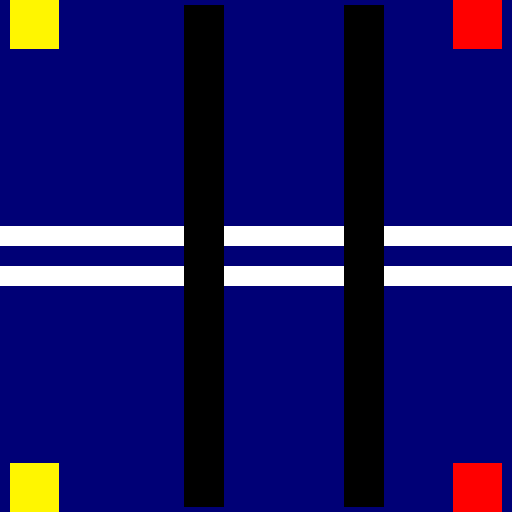
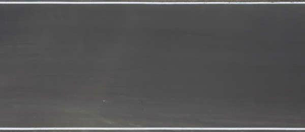

All code (as of 4/1/18) in the racing-game project written by Jonathan Lam and/or Rahul Kiefer, compiled for use in the AP CSP Create PT.

# TODO: add short descriptions for each file

Directory structure of necessary project files (* indicates a file/directory of code that we did not write, and therefore did not include as one of the files below), in order of the included files below:

    - node_modules *
    - package.json
    - Procfile
    - server.js
    - public/
        - index.html
        - game.html
        - js
            - three.js *
            - index.js
            - game.js
            - hostGraphics.js
            - clientGraphics.js
        - css
            - main.css
            - index.css
            - host.css
            - client.css
        - assets
            - map
                - map1.png
                - map2.png
            - blacktop_texture.jpg
            - dawnmountain-xneg.png
            - dawnmountain-xpos.png
            - dawnmountain-yneg.png
            - dawnmountain-ypos.png
            - dawnmountain-zneg.png
            - dawnmountain-zpos.png
            - grass_texture.jpg
            - loading_bg.png

---

`package.json` (necessary for Node.js); author: Jonathan Lam

    {
      "name": "racing-game",
      "description": "Multiplayer racing game for AP CSP Create task. Hosted online at https://racing-game-csp.herokuapp.com with Heroku hosting.",
      "contributors": [
        "Jonathan Lam <jonathan.lam@er9.org> (http://jonathanlam.tech)",
        "Rahul Kiefer <rahul.kiefer@er9.org>"
      ],
      "version": "0.0.1",
      "keywords": "multiplayer, racing, game, CSP, computer science principles, jonathan lam, rahul kiefer",
      "dependencies": {
        "express": "4.16.0",
        "express-session": "^1.15.6",
        "express-socket.io-session": "^1.3.2",
        "socket.io": "^2.0.4"
      },
      "repository": {
        "type": "git",
        "url": "https://www.github.com/jlam55555/racing-game.git"
      },
      "license": "MIT"
    }

---

`Procfile` (necessary for Heroku hosting); author: Jonathan Lam

    web: node server.js

---

`server.js` (server file); author: Rahul Kiefer and Jonathan Lam

    /**
      * Basic app routing using express
      * @author Jonathan Lam
      */

    // express and http packages for basic routing
    var express = require('express');
    var app = express();
    var http = require('http').Server(app);

    // set port to environment-defined port or 5000 (default)
    http.listen(
      process.env.PORT || 5000,
      () => console.log(`Listening on port ${process.env.PORT || 5000}.`));

    /**
      * Get socket.io dependency
      * @author Jonathan Lam
      */

    // socket.io for real-time WebSocket communication
    var io = require('socket.io')(http);
    var session = require('express-session')({
        secret: 'test-secret',
        resave: true,
        saveUninitialized: true
    });
    app.use(session);
    var sharedsession = require('express-socket.io-session');
    io.use(sharedsession(session, { autoSave: true }));

    // callback to listen for io events
    io.on('connection', socket => {

      // handle when a person connects
      console.log(`A user with socket id ${socket.id} has connected.`);

      // sync up to express
      socket.handshake.session.socketId = socket.id;
      socket.handshake.session.save();

      // handle when a person creates a new game
      socket.on('createNewGame', callback => {

        // make sure user is not already in a game
        if(socket.handshake.session.gameId !== undefined) return;

        // generate random id of five letters
        var gameIdCharacters = 'abcdefghijklmnopqrstuvwxyz';
        var gameId;
        do {
          gameId = '';
          while(gameId.length < 5) {
            gameId += gameIdCharacters.substr(Math.floor(Math.random() * gameIdCharacters.length), 1);
          }
        } while(Object.keys(rooms).indexOf(gameId) !== -1);

        rooms[gameId] = { host: null, clients: [] };

        callback(gameId);

      });

      // check if user is host
      socket.on('isHost', callback => {
        var hostInterval = setInterval(() => {
          socket.handshake.session.reload(() => {
            if(socket.handshake.session.host !== undefined) {
              clearInterval(hostInterval);
              callback(socket.handshake.session.host === true, socket.handshake.session.socketId);
            }
          });
        }, 50);
      });

      // set a user's name
      socket.on('setName', name => {
        // get room, set name
        var room = rooms[socket.handshake.session.gameId];
        room.clients.find(client => client.socketId === socket.id).name = name;

        // tell sockets to update names
        io.to(socket.handshake.session.gameId).emit('updateNames', room.clients.map(client => client.name));
      });

      // handle device orientation input
      socket.on('deviceOrientation', (forwardSpeed, turnSpeed) => {

        // if not in game return
        if(!socket.handshake.session.gameId) return;

        // get correct client
        var client = rooms[socket.handshake.session.gameId].clients.find(client => client.socketId === socket.id);

        // if host return
        if(!client) return;

        // update client acceleration, heading
        // acceleration is limited from -90 to +90
        // heading is converted into radians
        client.acceleration = -Math.max(-90, Math.min(90, forwardSpeed));
        client.turn = Math.PI/180 * turnSpeed;

        // prevent invalid accelerations and turn speeds
        if(client.acceleration < -90 || client.acceleration > 90) client.acceleration = 0;
        if(client.turn < -90 || client.turn > 90) client.turn = 0;
      });

      // handle when a person disconnects
      socket.on('disconnect', () => {
        console.log(`A user with socket id ${socket.id} has disconnected.`);

        // delete room if host
        if(socket.handshake.session.gameId !== undefined && socket.handshake.session.host === true) {
          // delete room
          delete rooms[socket.handshake.session.gameId];

          // tell users to go away
          io.to(socket.handshake.session.gameId).emit('terminateGame');
        }

        // delete person if client and if room exists
        else if(socket.handshake.session.gameId !== undefined && socket.handshake.session.host === false) {

          // only do if room exists (room may not exist because it is deleted when host leaves)
          var room = rooms[socket.handshake.session.gameId];
          if(room !== undefined) {

            // delete client from room
            room.clients = room.clients.filter(client => client.socketId !== socket.id);

            // update room host
            io.sockets.sockets[room.host.socketId].emit('updatedMap', room.clients);

            // update other users
            io.to(socket.handshake.session.gameId).emit('updateNames', room.clients.map(client => client.name));
          }
        }

        // also remove from session
        socket.handshake.session.gameId = undefined;
        socket.handshake.session.host = undefined;
        socket.handshake.session.save();
      });

    });

    /**
      * Do game updates (position, speed, acceleration (friction), and heading
      * (turn)) every 10ms. This happens here to ensure every person moves at the
      * same speed. The friction is calculated as a piecewise function (linear
      * decceleration at high speeds, and a decceleration proportional to the
      * speed at low speeds) to make the driving feel more realistic. The constants
      * and multipliers were determined by trial and error to make the driving
      * feel realistic.
      * 

      * Equations:
      * - Update speed:                 newSpeed          = oldSpeed + acceleration * accelerationMultiplier - friction
      * - Friction:                     friction          = { if |newSpeed| > frictionConstant * 1.5 then newSpeed > 0 ? -frictionConstant : frictionConstant
      *                                                       if |newSpeed| < frictionConstant * 1.5 then newSpeed * 0.5
      * - Update x position:            newPlayerX        = oldPlayerX + Math.cos(heading) * speed * speedMultiplier
      * - Update y position:            newPlayerY        = oldPlayerY + Math.sin(heading) * speed * speedMultiplier
      * - Update heading (direction):   newPlayerHeading  = oldPlayerHeading + turnSpeed * speed * turnMultiplier
      * @author Jonathan Lam
      */
    var accelerationMultiplier = 0.01;    // fraction of the input acceleration that goes into the accleration
    var speedMultiplier = 0.005;          // fraction of the input speed that goes into the speed
    var turnMultiplier = 0.0002;          // fraction of the input turn that goes into the turn
    var highSpeedFrictionConstant = 0.25; // linear decceleration of car at high speeds
    var lowSpeedFrictionMultiplier = 0.1; // fraction of the speed that the friction will go against
    setInterval(() => {
      // update every game room
      for(var room of Object.keys(rooms)) {
        for(var client of rooms[room].clients) {

          // update player speed
          client.speed += client.acceleration * accelerationMultiplier;
          // bound player speed between -180 and +180
          if(client.speed < -90) client.speed = -90;
          if(client.speed > 90) client.speed = 90;

          // calculated simulated friction and add to speed
          var friction = (Math.abs(client.speed) > highSpeedFrictionConstant * 1.5)
            ? (client.speed > 0 ? 1 : -1) * highSpeedFrictionConstant
            : client.speed * lowSpeedFrictionMultiplier;
          client.speed -= friction;

          // update player position (depends on heading)
          client.x += Math.cos(client.heading) * client.speed * speedMultiplier;
          client.y += Math.sin(client.heading) * client.speed * speedMultiplier;

          // update player heading (turn speed is proportional to the speed and angle of turn)
          client.heading += client.turn * client.speed * turnMultiplier;
        }

        // send data to host
        var socket;
        if(rooms[room].host && (socket = io.sockets.sockets[rooms[room].host.socketId]) !== undefined) {
          socket.emit('updatedMap', rooms[room].clients);
        }
        // send data to clients
        for(var client of rooms[room].clients) {
          if((socket = io.sockets.sockets[client.socketId]) !== undefined) {
            socket.emit('updatedMap', rooms[room].clients);
          }
        }
      }
    }, 10);

    /**
      * Rooms to allow people to play multiplayer
      * @todo   add verification that server is created, number of people is less than 3
      * @author Jonathan Lam
      */

    var rooms = {};
    /*
    room format: {
      host: [hostId],
      clients: [arrayOfClientIds]
    }
    client format: {
      name: [name],
      id: [sessionId],
      x: [xPosition],
      y: [yPosistion],
      z: 0 (for now),
      heading: [heading]
    }
    */

    app.get('/game/:gameId', (req, res, next) => {

      // send to game file
      res.sendFile(`${__dirname}/public/game.html`);

      // get gameid parameter
      var gameId = req.params.gameId.toLowerCase();
      var socket;

      // sync up to socket to join room (keep refreshing until socketId is updated)
      var syncInterval = setInterval(() => req.session.reload(() => {
        if(req.session.socketId !== undefined && (socket = io.sockets.sockets[req.session.socketId]) !== undefined) {
          clearInterval(syncInterval);

          // error 1: room does not exist
          if(Object.keys(rooms).indexOf(gameId) === -1) {
            socket.emit('err', `Game room "${gameId}" does not exist.`);
            return;
          }

          // error 2: room has more than four people in it
          if(rooms[gameId].clients.length > 3) {
            socket.emit('err', `Game room "${gameId}" is already full.`);
            return;
          }

          // error 3: user is already in the game
          if(rooms[gameId].clients.find(client => client.sessionId === req.session.id) !== undefined || (rooms[gameId].host && rooms[gameId].host.sessionId === req.session.id)) {
            socket.emit('err', 'You are already in this game on another tab.');
            return;
          }

          // add gameId to session, session id to game room
          req.session.gameId = gameId;

          // if first person, then host; if not, then client
          if(rooms[gameId].host === null) {
            rooms[gameId].host = {
              sessionId: req.session.id,
              socketId: socket.id
            };
            req.session.host = true;
          } else {
            // create default client
            rooms[gameId].clients.push({
              sessionId: req.session.id,
              socketId: socket.id,
              name: null,
              x: 0,
              y: 0,
              z: 0,
              acceleration: 0,
              speed: 0,
              heading: 0,
              turn: 0
            });
            req.session.host = false;
          }
          req.session.save();

          // join game room
          socket.join(gameId);
          socket.emit('gameId', gameId);
          io.to(gameId).emit('updateNames', rooms[gameId].clients.map(client => client.name));
          console.log(`A user with socket id ${socket.id} has joined the room ${gameId}.`);
        }
      }), 50);
    });

    /**
      * Static serving in express for resources (*.css, *.js)
      * @author Jonathan Lam
      */
    app.use(express.static('public'));

---

`public/index.html`; author: Rahul Kiefer and Jonathan Lam

    <!--
      Basic HTML layout
      @author Jonathan Lam
      -->
    <!doctype html>
    <html>
      <head>
        <title>Racing Game</title>

        <!--
          meta tags for site crawling
          @author Jonathan Lam
          -->
        <meta charset='utf-8'>
        <meta name='description' content='Multiplayer racing game for AP CSP Create task'>
        <meta name='author' content='Jonathan Lam <jonathan.lam@er9.org>, Rahul Kiefer <rahul.kiefer@er9.org>'>
        <meta name='keywords' content='multiplayer, racing, game, CSP, computer science principles, jonathan lam, rahul kiefer'>

        <!--
          Set the viewport for responsive web design on mobile
          This doesn't work too well, so commented it out
          @author Jonathan Lam
          -->
        <!-- <meta name='viewport' content='width=device-width, initial-scale=1.0'> -->

        <!--
          include stylesheets
          @author Jonathan Lam
          -->
        <link rel='stylesheet' href='css/main.css'>
        <link rel='stylesheet' href='css/index.css'>

        <!--
          include FontAwesome icon set (to make website look pretty)
          See https://fontawesome.com/ for more information
          @author Jonathan Lam
          -->
        

        <!--
          include socket.io library for use of WebSockets/long-polling to communicate in real time with server
          See https://socket.io/ for more information
          @author Jonathan Lam
          -->
        

        <!--
          include main script
          @author Jonathan Lam
          -->
        

      </head>
      <body>

        <!--
          Create a room for hosts
          @author Jonathan Lam
          -->
        

          <!--
            Link to GitHub for information and code
            @author Jonathan Lam
            -->
          <a id='infoLink' title='Click to see more information and the source on GitHub.' href='https://github.com/jlam55555/racing-game' target='_blank'>
            <i class='fas fa-info-circle'></i>
          </a>

          

            <i class='fas fa-desktop'></i>
          

          <button id='createGame'>CREATE GAME</button>
        

        <!--
          Join a room for mobile
          @author Jonathan Lam
          -->
        

          

            <i class='fas fa-mobile'></i>
          

          

            <input type='text' id='joinGameId' placeholder='GAME ID'>
            <button id='joinGame'>JOIN GAME</button>
          

        

      </body>
    </html>

---

`public/game.html`; author: Rahul Kiefer and Jonathan Lam

    <!--
      Basic HTML layout
      @author Jonathan Lam
      -->
    <!doctype html>
    <html>
      <head>
        <title>Racing Game</title>

        <!--
          meta tags for site crawling
          @author Jonathan Lam
          -->
        <meta charset='utf-8'>
        <meta name='description' content='Multiplayer racing game for AP CSP Create task'>
        <meta name='author' content='Jonathan Lam <jonathan.lam@er9.org>, Rahul Kiefer <rahul.kiefer@er9.org>'>
        <meta name='keywords' content='multiplayer, racing, game, CSP, computer science principles, jonathan lam, rahul kiefer'>

        <!--
          Set the viewport for responsive web design on mobile
          This didn't work too well, so commented it out for now
          @author Jonathan Lam
          -->
        <!-- <meta name='viewport' content='width=device-width, initial-scale=1.0'> -->

        <!--
          include stylesheets
          @author Jonathan Lam
          -->
        <link rel='stylesheet' href='/css/main.css'>
        <link rel='stylesheet' href='/css/host.css'>
        <link rel='stylesheet' href='/css/client.css'>

        <!--
          include socket.io library
          @author Jonathan Lam
          -->
        

        <!--
          include three.min.js library
          See https://threejs.org/ for more information
          @author Rahul kiefer
          -->
        

        <!--
          include THREE.js line library files (not included in main THREE.js library) to make race track
          Source: https://github.com/mrdoob/three.js/tree/cb4c23fea8b667b6126635be64825d0cc1fa5f4b/examples/js/lines
          @author Rahul Kiefer
          -->
        
        
        
        
        
        
        

        <!--
          include FontAwesome icon set (to make website look pretty)
          @author Jonathan Lam
          -->
        

        <!--
          Includes the graphics script.
          

          hostGraphics.js is for the computer (host). This includes views for all players, and sets up the basic scene.
          

          clientGraphics.js is for the mobile device (client). This includes a simplified, single viewport that is shown on mobile devices.
          @author Rahul Kiefer
          -->
        
        

        <!--
          include main script
          @author Jonathan Lam
          -->
        

      </head>
      <body>

        <!--
          Controls div on left
          @author Jonathan Lam
          -->
        

          <!-- Show names (these are absolutely positioned over the canvas) -->
          

          <!-- Link to return to homepage -->
          <a id='homeLink' href='/' class='vCenter'>
            
          </a>

          <!-- Shows errors if they exist on entry -->
          

          <!-- Show game ID -->
          

            
              ID: 
            
          

        

        <!--
          Main canvas on right
          @author Jonathan Lam
        -->
        

      </body>
    </html>

---

`public/js/index.js`; author: Jonathan Lam

    /**
      * This file is for the homepage.
      */

    /**
      * Connect to socket.io
      * @author Jonathan Lam
      */
    var socket = io();

    /**
      * Create a game when button is clicked
      * @author Jonathan Lam
      */
    var createGameButton = document.querySelector('#createGame');
    createGameButton.addEventListener('click', () => {
      // redirect to page on click
      socket.emit('createNewGame', newGameId => {
        window.location.href = `${window.location.href}game/${newGameId}`;
      });
    });

    /**
      * Join a room when button is clicked
      * @author Jonathan Lam
      */
    var joinGameId = document.querySelector('#joinGameId');
    var joinGameButton = document.querySelector('#joinGame');
    joinGameButton.addEventListener('click', () => {
      if(joinGameId.value.trim() !== '') {
        window.location.href = `${window.location.href}game/${joinGameId.value}`;
      }
    })

    /**
      * Make recommendation
      * @author Jonathan Lam
      */
    // if large window size or deviceorientationevent not supported, recommend host
    if(window.innerWidth >= 1920 || !window.DeviceOrientationEvent) {
      document.querySelector('#desktopContainer').classList.add('recommended');
    }
    // else recommend client
    // this double-checks if deviceorientationevent works (and if it doesn't, recommends desktop)
    else {
      if(window.DeviceOrientationEvent) {
        window.addEventListener('deviceorientation', event => {
          if(event.alpha === null) {
            document.querySelector('#desktopContainer').classList.add('recommended');
          } else {
            document.querySelector('#mobileContainer').classList.add('recommended');
          }
        });
      } else {
        document.querySelector('#mobileContainer').classList.add('recommended');
      }
    }

---

`public/js/game.js`; author: Rahul Kiefer and Jonathan Lam

    /**
      * This file is for the game (excluding graphics).
      */

    /**
      * Connect to socket.io
      * @author Jonathan Lam
      */
    var socket = io();

    // get game id to show on element #gameId
    socket.on('gameId', gameId => {
      var gameIdText = "";
      var gameIdChars = gameId.split("");
      for(var char of gameIdChars) {
        gameIdText += `${char.toUpperCase()}`;
      }
      document.querySelector('#gameId').innerHTML = gameIdText;
    });

    /**
      * Get errors on joining room
      * @author Jonathan Lam
      */
    socket.on('err', msg => {
      document.querySelector('#gameIdContainer').style.display = 'none';
      document.querySelector('#names').style.display = 'none';
      document.querySelector('#error').textContent = `Error: ${msg}`;
    });

    /**
      * Get name if client
      * @author Jonathan Lam
      */
    var isHost;
    var socketId;
    socket.emit('isHost', (isHostResponse, socketIdResponse) => {

      if(!isHostResponse) {

        // ask for name, send to server
        var defaultNames = ["Richard","Rasmus","Tony","Aubrey","Don Juan","Graham","Dennis","George","Ted","Rufus","Rami","Willem","Peter","Zack","Oscar","Rick","Brandon","Charlie","Louie","Phil","Nigel","Earl","Jones","Carl","Jake","Richter","Russell",
                            "Corey","Alex","Ash","Mark","Irvin","Dallas\n "]
        var name = prompt('What is your name?', defaultNames[Math.floor(Math.random() * defaultNames.length)]);
        socket.emit('setName', name);

        // set socketId
        socketId = socketIdResponse;

      }

      // set host flag (true if host, false if client)
      isHost = isHostResponse;
    });

    /**
      * Update name listing
      * @author Jonathan Lam
      */
    var namesElement = document.querySelector('#names');
    socket.on('updateNames', names => {

      /**
        * Position name on top left of correct screen
        * @author Jonathan Lam
        */
      var positions;
      switch(names.length) {
        // one person joined: full screen
        case 1:
          positions = [ [ 0, 0 ] ];
          break;
        // two people in the game: side by side
        case 2:
          positions = [ [ 0, 0 ], [ width/2, 0 ] ];
          break;
        // three people in the game: top two side by side, bottom in center
        case 3:
          positions = [ [ 0, 0 ], [ width/2, 0 ], [ width/4, height/2 ] ];
          break;
        // four people in the game: top two side by side, bottom two side by side
        case 4:
          positions = [ [ 0, 0 ], [ width/2, 0 ], [ 0, height/2 ], [ width/2, height/2 ] ];
          break;
        // nobody joined; no positions
        case 0:
        default:
          break;
      }

      var namesElement = document.querySelector('#names');
      namesElement.innerHTML = '';
      for(var i = 0; i < names.length; i++) {
        var nameDiv = document.createElement('div');
        nameDiv.classList.add('name');
        nameDiv.style.left = positions[i][0] + 40 + 'px'; // added padding 40px
        nameDiv.style.top = positions[i][1] + 40 + document.querySelector('#controls').clientHeight + 'px';  // added padding 40px plus height of controls
        nameDiv.appendChild(document.createTextNode(names[i] || 'An unnamed driver'));
        namesElement.appendChild(nameDiv);
      }

      // update cars and cameras
      updateCars();

      // if client
      if(isHost !== undefined && !isHost) {

        // overwrite main render function with client one
        overwriteRender(socketId);

        // add .mobile class to controls to transform it
        document.querySelector('#controls').classList.add('mobile');

      }

    });

    /**
      * Terminate game (if host leaves)
      * @author Jonathan Lam
      */
    socket.on('terminateGame', () => {
      window.location.href = '/';
    });

    /**
      * If client, get orientation event and send to server
      * Calculates forward speed from gamma (and beta), turn from beta
      * @author Jonathan Lam
      */
    window.addEventListener('deviceorientation', event => {

      // only do this for client
      if(isHost) return;

      // adjusting the 'no pedal' position from flat to 45 degrees
      var beta = event.beta;
      var gamma = event.gamma + 45;

      var forwardSpeed = 0, turnSpeed = 0;
      // device facing upwards
      if(Math.abs(beta) < 90) {
        forwardSpeed = gamma;
        turnSpeed = beta;
      }
      // device facing downwards -- put at extreme (-90 or 90)
      else {
        forwardSpeed = gamma < 0 ? 90 : -90;
        turnSpeed = (beta < 0 ? -180 : 180) - beta;
      }

      // send in deviceorientation
      // comment this for testing on desktop
      socket.emit('deviceOrientation', forwardSpeed, turnSpeed);

    });
    // uncomment this for testing on desktop
    // setTimeout( () => socket.emit('deviceOrientation', 10, 50), 1000 );

    /**
      * Get all client positions
      * Host will show all
      * Client will show view from just their car
      * @author Jonathan Lam
      */
    socket.on('updatedMap', mapData => {
      map = mapData;
    });

---

`public/hostGraphics.js`; author: Rahul Kiefer and Jonathan Lam

    /**
      * host graphics file
      * 

      * Critical functions: init(), animate(), render()
      * @author Rahul Kiefer
      */

    /**
      * Use #game as base element
      * width and height are global variables used for the width and height of the canvas, and are set in the resize handler
      * @author Jonathan Lam
      */
    var element = document.querySelector('#game'), width, height;

    /**
      * Event handler to update width and height on window resize (canvas resizes automatically). Also called in init() to initialize width and height.
      * @author Jonathan Lam
      */
    function resizeHandler() {

      // update width and height
      width = element.getBoundingClientRect().width;
      height = element.getBoundingClientRect().height;

      // update main camera aspect ratio and renderer size
      camera = new THREE.PerspectiveCamera(75, width / height, 0.1, 1000);
      renderer.setSize(width, height);

    }
    window.addEventListener('resize', resizeHandler);

    /**
      * Create scene and camera
      * @author Rahul Kiefer
      */
    var scene = new THREE.Scene();
    var camera = new THREE.PerspectiveCamera(75, width / height, 0.1, 1000);

    /**
      * Create renderer
      * @author Rahul Kiefer
      */
    var renderer = new THREE.WebGLRenderer();
    renderer.setSize(width, height);
    element.appendChild(renderer.domElement);

    /**
      * Car class (a function as per JS standards). Create using 'new Car()'
      * 

      * Publicly available fields: .mesh (to change position and rotation)
      * @param  id The id of the car (the socketId of the client) to correctly match the client camera to the car
      * @todo   Make member fields private
      * @return undefined
      * @author Rahul Kiefer
      */
    function Car(id) {

      /**
        * Set id of car (to attach camera to correct car on mobile)
        * @author Jonathan Lam
        */
      this.id = id;

      /**
        * Draw shape of car, and then extrude
        * @author Rahul Kiefer
        */
      var hoodHeight = 1.25;               // height of a car's hood
      var carHeight = hoodHeight + .75;    // distance between ground and roof

      // drawing the car shape
      this.shape = new THREE.Shape();
      this.shape.moveTo(0, 0);
      this.shape.lineTo(0, hoodHeight);    // from front bottom to front of hood
      this.shape.lineTo(2, hoodHeight);    // from front of hood to windshield
      this.shape.lineTo(2.5, carHeight);   // from bottom of windshield to top of windshield
      this.shape.lineTo(4.5, carHeight);   // from top of windshield to top of back window
      this.shape.lineTo(5, hoodHeight);    // from top of back window to bottom of back window
      this.shape.lineTo(6, hoodHeight);    // from bottom of back window to top of trunk
      this.shape.lineTo(6, 0);             // from top of trunk to bottom of trunk
      this.shape.lineTo(0, 0);

      // use basic extrudegeometry
      this.extrudeSettings = {
        steps: 1,               // extrudegeometry uses one intermediate shape
        amount: 3,              // width of car
        bevelEnabled: false,    // bevel set to false to make the texture (UV) mapping easier
        // bevelThickness: .5,
        // bevelSize: .5,
        // bevelSegments: 2,
        material: 0,            // first material (texture) in material array is for sides
        extrudeMaterial: 1      // second material (texture) in material array is for the front, hood, windshield, top, rear windshield, rear hood, rear (and bottom)
      }
      this.geometry = new THREE.ExtrudeGeometry(this.shape, this.extrudeSettings);

      /**
        * Create materials (lambert textures) with UV mapping for custom extrude geometry
        * @author Jonathan Lam
        */

      // load materials
      this.materials = [];
      for(var i = 0; i < 2; i++) {
        // texture 1 (sides) is located at /assets/map/map1.png
        // texture 2 (other faces) is located at /assets/map/map2.png
        var texture = new THREE.TextureLoader().load(`/assets/map/map${i+1}.png`);
        if(i == 1) {
          // scaling for the extrude material
          // scale goes from x: 0-2, y: (-2)-1 (this is for the UV mapping to work)
          texture.repeat.set(1/2, 1/3);
          texture.offset.set(0, 2/3);
        } else {
          // scaling for the side material
          // scale goes from x: 0-6, y: 0-2
          texture.repeat.set(1/6, 1/2);
        }
        this.materials.push(new THREE.MeshLambertMaterial({ map: texture }));
      }

      /**
        * UV mapping for the car texture
        * 

        * Brief description of UV mapping: UV mapping is a system to get a 2D image
        * wrapped around a 3D shape. Luckily, this is relatively easy for objects
        * with flat faces (such as this car), which means that we simply have to
        * translate coordinates from the 2D "map" to the 3D geometry.
        * 

        *
        *   (0, 1)               (2, 1)     // The map is a square image with
        *   +--------------------+          // the labelled (U, V) coordinates.
        *   |                    |          // These specific (U, V) coordinates
        *   |                    |          // were made to wrap around the car.
        *   |                    |
        *   |                    |
        *   |                    |
        *   |                    |
        *   +--------------------+
        *   (0, -2)              (2, -2)
        *
        * 

        * Different 3D triangular "faces" of the car geometry, numbered 12-25, were
        * programatically mapped to the corresponding (U, V) coordinates on the
        * map.
        * 

        * Made with a LOT of painstaking trial-and-error. =/ I thought this
        * deserves its own special comment.
        * @author Jonathan Lam
        */

      // no change to sides (faceVertexUvs indeces 0-11)
      // no change to bottom (faceVertexUvs indeces 26-27)

      // side lengths correspond to the lengths of the sides of the car's Shape
      var sideLengths = [ 0, 1.25, 2, Math.sqrt(0.5*0.5 + 0.75*0.75), 2, Math.sqrt(0.5*0.5 + 0.75*0.75), 1, 1.25 ];
      // cumulative lengths correspond to the length of the sides from the start of the car's Shape
      var cumulativeLengths = sideLengths.map((e, index) => sideLengths.slice(0, index+1).reduce((accumulator, value) => accumulator + value));
      // positions correspond to the scaled version of the cumulative lengths for the UV map
      var positions = cumulativeLengths.map(length => length / cumulativeLengths[cumulativeLengths.length-1] * 2);

      // start from front, go to back (index 25 is front, index 14 is back)
      for(var i = 25; i >= 12; i--) {

        // generate correct set of UV map points in points array
        var points;

        // even face numbers
        if(i % 2 == 0) {
          points = [
            { x: positions[(25-i-1) / 2 + 1], y: 1 },
            { x: positions[(25-i-1) / 2],     y: 1 },
            { x: positions[(25-i-1) / 2 + 1], y: -2 },
          ];
        }
        // odd face numbers
        else {
          points = [
            { x: positions[(25-i) / 2],     y: 1 },
            { x: positions[(25-i) / 2],     y: -2 },
            { x: positions[(25-i) / 2 + 1], y: -2 },
          ];
        }

        // add uv map to geometry
        this.geometry.faceVertexUvs[0][i] = points;
      }

      /**
        * Create mesh and add to scene
        * @author Rahul Kiefer
        */
      this.mesh = new THREE.Mesh(this.geometry, this.materials);
      scene.add(this.mesh);

      /**
        * Attach a camera to a car when car joins
        * Called in updateCars()
        * @author Jonathan Lam
        */
      this.addCamera = camera => {
        this.camera = camera;
        this.mesh.add(camera);
      };

      /**
        * Remove a car and its associated camera when car leaves
        * Called in updateCars()
        * @author Jonathan Lam
        */
      this.remove = () => {
        this.mesh.remove(this.camera);
        scene.remove(this.mesh);
      };
    }

    // initial car at 0,0 for testing and as a reference point
    // remove in production code
    // var car = new Car();

    /**
      * Creating multiple views
      * @todo   Make this programatically instead of hardcoding it in, explain position and rotation metrics
      * @author Jonathan Lam
      */
    var views = [
      // car 1: left top [currently: viewing car from front *FIX*]
      {
        left: 0,
        top: 0,
        width: 0.5,
        height: 0.5,
        // position: [3, -15, 1.5], rotation: [Math.PI/2, 0, 0], // BOTTOM (for debug)
        // position: [-10, 1, 1.5], rotation: [0, -Math.PI/2, 0],// FRONT  (for debug)
        // position: [3, 15, 1.5], rotation: [-Math.PI/2, 0, 0], // TOP    (for debug)
        // position: [3, 1, 15], rotation: [0, 0, 0],            // SIDE   (for debug)
        // position: [20, 1, 1.5], rotation: [0, Math.PI/2, 0],  // BACK   (for debug)
        position: [20, 3, 1.5], rotation: [0, Math.PI/2, 0],  // NORMAL (for prod)
        fov: 30,
        enabled: true
      },
      // car 2: right top (looking down on car from above)
      {
        left: 0.5,
        top: 0,
        width: 0.5,
        height: 0.5,
        position: [20, 3, 1.5],
        rotation: [0, Math.PI/2, 0],
        fov: 30
      },
      // car 3: left bottom
      {
        left: 0,
        top: 0.5,
        width: 0.5,
        height: 0.5,
        position: [20, 3, 1.5],
        rotation: [0, Math.PI/2, 0],
        fov: 30
      },
      // car 4: right bottom
      {
        left: 0.5,
        top: 0.5,
        width: 0.5,
        height: 0.5,
        position: [20, 3, 1.5],
        rotation: [0, Math.PI/2, 0],
        fov: 30
      }
    ];

    /**
      * updateCars() function
      * This is called every time a user enters leaves (upon the 'updateNames' message from socket.io (see /public/js/game.js))
      * @return undefined
      * @author Jonathan Lam
      */

    // map and car arrays to map (client positions) and cars (Car objects)
    var map = [];
    var cars = [];

    // updateCars function
    function updateCars() {

      // remove all cars ("reset" array)
      for(var i = 0; i < cars.length; i++) {
        cars[i].remove();
      }
      cars = [];

      // make new cars ("refresh" the array)
      for(var i = 0; i < map.length; i++) {
        var car = new Car(map[i].socketId);
        // x and y are coordinates on flat plane in server
        // x and z are coordinates on flat plane in three.js
        car.mesh.position.x = map[i].x;
        car.mesh.position.z = map[i].y;
        car.mesh.position.y = map[i].z;
        car.addCamera(views[i].camera);
        cars.push(car);
      }

      // disable all views after view 1 that are enabled
      // i.e., the first view is default, even if no cars; the others are triggered by multiple people entering the game
      for(var i = 1; i < views.length; i++) {
        views[i].enabled = i < cars.length;
      }

      /**
        * Set views appropriate to number of cars
        * 

        * One car or no cars: full screen             +---------+
        *                                             |         |
        *                                             |         |
        *                                             |    1    |
        *                                             |         |
        *                                             |         |
        *                                             +---------+
        * 

        * Two cars: half screen horizontally          +----+----+
        *                                             |    |    |
        *                                             |    |    |
        *                                             | 1  | 2  |
        *                                             |    |    |
        *                                             |    |    |
        *                                             +----+----+
        * 

        * Three cars: half screen top, bottom center  +----+----+
        *                                             | 1  | 2  |
        *                                             |    |    |
        *                                             +--+-+-+--+
        *                                             |  | 3 |  |
        *                                             |  |   |  |
        *                                             +--+---+--+
        * 

        * Four cars: 2 on top, two on bottom          +----+----+
        *                                             | 1  | 2  |
        *                                             |    |    |
        *                                             +----+----+
        *                                             | 3  | 4  |
        *                                             |    |    |
        *                                             +----+----+
        * 

        * This layout was designed to maximize screen usage, keep aspect ratio reasonable, and keep the same size/AR for all clients.
        * @author Jonathan Lam
        */
      switch(cars.length) {
        case 0:
        case 1:
          // if no cars or one car, set full-screen
          views[0].width = 1.0;
          views[0].height = 1.0;
          break;
        case 2:
          // if two cars, set side by side
          views[0].width = views[1].width = 0.5;
          views[0].height = views[1].height = 1.0;
          views[1].left = 0.5;
          break;
        case 3:
          // if three or four cars, set to one-quarter screen size
          views[0].width = views[1].width = views[2].width = 0.5;
          views[0].height = views[1].height = views[3].height = 0.5;
          views[1].left = 0.5;
          views[2].top = 0.5;
          views[2].left = 0.25;
          break;
        case 4:
          views[0].width = views[1].width = views[2].width = views[3].width = 0.5;
          views[0].height = views[1].height = views[3].height = views[3].height = 0.5;
          views[1].left = 0.5;
          views[2].top = 0.5;
          views[2].left = 0.0;
          views[3].top = 0.5;
          views[3].left = 0.5;
          break;
      }
    }

    /**
      * init() function to set up views, objects
      * @return undefined
      * @author Rahul Kiefer
      */
    function init() {

      // initialize width and height
      resizeHandler();

      // create a camera for every view, using views array values
      for(var view of views) {
        var camera = new THREE.PerspectiveCamera(view.fov, width/height, 0.1, 7500);
        camera.position.fromArray(view.position);
        camera.rotation.fromArray(view.rotation);
        view.camera = camera;
      }

      /**
        * Create skybox (side length of 5000)
        * Example used for template: stemkoski.github.io/Three.js/Skybox.html
        * @todo   Change images to match theme
        * @author Jonathan Lam
        */
      var imagePrefix = '/assets/dawnmountain-';
      var directions  = [ 'xpos', 'xneg', 'ypos', 'yneg', 'zpos', 'zneg' ];
      var imageSuffix = '.png';
      var skyGeometry = new THREE.CubeGeometry(5000, 5000, 5000);

      var materialArray = [];
      for (var i = 0; i < 6; i++) {
        materialArray.push(new THREE.MeshBasicMaterial({
          map: new THREE.TextureLoader().load(imagePrefix + directions[i] + imageSuffix),
          side: THREE.BackSide
        }));
      }
      var skyMaterial = materialArray;
      var skyBox = new THREE.Mesh(skyGeometry, skyMaterial);
      scene.add(skyBox);

      /**
        * Create spot light (sun, directly above)
        * @author Rahul Kiefer
        */
      var spotLight = new THREE.PointLight( 0xffffff );
      spotLight.position.set(0, 1000, 0);

      spotLight.shadow.camera.near = 500;
      spotLight.shadow.camera.far = 10000;

      scene.add(spotLight);

      /**
        * Create ambient light (is this necessary?)
        * @todo   Remove?
        * @author Rahul Kiefer
        */
      var ambLight = new THREE.AmbientLight(0xf5f5f5); //soft white light
      scene.add(ambLight);

      /**
        * Create the floor
        * @author Rahul Kiefer
        */
      var floorTexture = new THREE.TextureLoader().load('/assets/grass_texture.jpg');
      floorTexture.wrapS = floorTexture.wrapT = THREE.RepeatWrapping;
      floorTexture.repeat.set(50, 50);
      var floorMaterial = new THREE.MeshBasicMaterial( { map: floorTexture, side: THREE.DoubleSide } ); //floor looks better as a MeshBasicMaterial
      var floorGeometry = new THREE.PlaneGeometry(5000, 5000, 10, 10); //floor is 5000x5000 to match skybox
      var floor = new THREE.Mesh(floorGeometry, floorMaterial);
      floor.rotation.x = Math.PI / 2;
      scene.add(floor);

      /**
        * Creating race track from path
        * @author Rahul Kiefer
        */

        // race track as a fat line
        // var trackPositions = [
        //   (150,50),
        //   (150,150),
        //   (100,175),
        //   (50,150),
        //   (50,50),
        //   (100,25),
        //   (150,50)
        // ];
        //
        // var trackGeo = new THREE.LineGeometry();
        //
        // trackGeo.setPositions(trackPositions);
        //
        // matLine = new THREE.LineMaterial( {
        //   color: 0xffffff,
        //   linewidth: 50, //in px
        //   vertexColors: THREE.vertexColors,
        //   dashed: false
        // } );
        //
        // raceTrack = new THREE.Line2(trackGeo, matLine);
        // raceTrack.computeLineDistances();
        // raceTrack.scale.set(1, 1, 1);
        // scene.add(raceTrack);

      /*

      var track = new THREE.Shape();

      track.moveTo(150,50);
      track.lineTo(150,150);
      track.quadraticCurveTo(150,175,100,175);
      track.quadraticCurveTo(50,175,50,150);
      track.lineTo(50,50);
      track.quadraticCurveTo(50,25,100,25);
      track.quadraticCurveTo(150,25,150,50);

      var trackExtrudeSettings = {
        amount: 5,
        bevelEnabled: false,
        bevelSegments: 2,
        steps: 1,
        bevelSize: 1,
        bevelThickness: 1
      };

      var trackTexture = new THREE.TextureLoader().load('/assets/blacktop_texture.jpg');
      trackTexture.wrapS = trackTexture.wrapT = THREE.RepeatWrapping;
      trackTexture.repeat.set( 1, 1 );
      var trackMaterial = new THREE.MeshBasicMaterial( {map: trackTexture, side: THREE.DoubleSide} );
      var trackGeometry = new THREE.ExtrudeGeometry(track, trackExtrudeSettings);
      var raceTrackMesh = new THREE.Mesh( trackGeometry, trackMaterial );

      raceTrackMesh.rotation.x = Math.PI / 2;
      raceTrackMesh.position.y = 0.01; //barely above the ground
      scene.add(raceTrackMesh);

      */

      var track = new THREE.Shape();

      track.moveTo(150,-2500);
      track.lineTo(150,2500);
      track.lineTo(100,2500);
      track.lineTo(100,-2500);
      track.lineTo(150,-2500);

      var trackExtrudeSettings = {
        amount: 5,
        bevelEnabled: false,
        bevelSegments: 2,
        steps: 1,
        bevelSize: 1,
        bevelThickness: 1
      };

      var trackTexture = new THREE.TextureLoader().load('/assets/blacktop_texture.jpg');
      trackTexture.wrapS = trackTexture.wrapT = THREE.RepeatWrapping;
      trackTexture.repeat.set( 1, 1 );
      var trackMaterial = new THREE.MeshBasicMaterial( {map: trackTexture, side: THREE.DoubleSide} );
      var trackGeometry = new THREE.ExtrudeGeometry(track, trackExtrudeSettings);
      var raceTrackMesh = new THREE.Mesh( trackGeometry, trackMaterial );

      raceTrackMesh.rotation.x = Math.PI / 2;
      raceTrackMesh.position.y = 0.01; //barely above the ground
      scene.add(raceTrackMesh);

    }

    /**
      * Function animate() to run the animation
      * This is run on every frame, by window.requestAnimationFrame()
      * @return undefined
      * @author Rahul Kiefer
      */
    function animate() {
      // update coordinates of cars
      for(var i = 0; i < map.length; i++) {
        if(cars[i]) {
          // see note above for switched z and y
          cars[i].mesh.position.x = map[i].x;
          cars[i].mesh.position.z = -map[i].y;
          cars[i].mesh.position.y = map[i].z;
          cars[i].mesh.rotation.y = map[i].heading;
        }
      }

      // render views
      render();

      // wait until canvas ready to render
      requestAnimationFrame(animate);
    }

    /**
      * render() function to render the scene by setting up each viewport (camera) as appropriate
      * @author Jonathan Lam
      */
    function render() {
      for(var view of views) {
        // if disabled, skip
        if(!view.enabled) continue;

        var camera = view.camera;

        // set viewport
        var viewLeft = Math.floor(width * view.left);
        var viewTop = Math.floor(height * view.top);
        var viewWidth = Math.floor(width * view.width);
        var viewHeight = Math.floor(height * view.height);

        renderer.setViewport(viewLeft, viewTop, viewWidth, viewHeight);
        renderer.setScissor(viewLeft, viewTop, viewWidth, viewHeight);
        renderer.setScissorTest(true);
        renderer.setClearColor(view.background);

        // update camera
        camera.aspect = viewWidth/viewHeight;
        camera.updateProjectionMatrix();

        // render view
        renderer.render(scene, camera);
      }
    }

    // initialize the scene (both for clients and host)
    init();

    // begin the simulation/animation/game
    animate();

---

`public/graphics/clientGraphics.js`; author: Rahul Kiefer and Jonathan Lam

    /**
      * client graphics file
      * 

      * Critical functions: render() (overwrite the one in hostGraphics)
      * Initialization is already set up in the main graphics file
      * @author Jonathan Lam
      */

    /**
      * Function overwriteRender to overwrite the main render function for a client
      * device.
      * 

      * This is called when the user's car is created (after the first updateCars()
      * in the 'updateNames' websocket event). It replaces the four-car view with a
      * simple view from the windshield of the client's car.
      * @param  id  socketId of the client; used to match the car
      * @return none
      * @author Jonathan Lam
      */
    function overwriteRender(id) {

      // create camera
      var camera = new THREE.PerspectiveCamera(30, width/height, 0.1, 20000);
      camera.position.set(0, 3, 1.5);
      camera.rotation.set(0, Math.PI/2, 0);

      // attach camera to car (match socket ids)
      cars.find(car => car.id === id).addCamera(camera);

      // simple, single camera full-screen viewport
      render = function() {
        renderer.setViewport(0, 0, width, height);
        renderer.render(scene, camera);
      };
    }

---

`public/css/main.css`; author: Jonathan Lam

    /**
      * Generic page style
      * Applies to both index.html and game.html
      */

    /**
      * Import source code pro monospace font for use
      * @author Jonathan Lam
      */
    @import url('https://fonts.googleapis.com/css?family=Source+Code+Pro');

    /**
      * Set basic styles for all elements and html, body
      * @author Jonathan Lam
      */
    * {
      box-sizing: border-box;
    }
    html, body {
      margin: 0;
      height: 100%;
      font-size: 16px;
      font-family: source code pro, monospace;
    }
    a, button, select, input {
      outline: none;
      border: none;
      font-size: inherit;
      font-family: inherit;
      color: inherit;
    }
    button, input {
      border: none;
      padding: 1em;
    }
    input {
      background-color: #eee;
    }

---

`public/css/index.css`; author: Jonathan Lam

    /**
      * Styles for homepage
      * Applies to index.html
      */

    /**
      * Put computer and smartphone divs side by side
      * @author Jonathan Lam
      */
    body {
      display: flex;
      flex-direction: row;
      background-image: url('/assets/loading_bg.png');
      background-position: center;
      background-size: cover;
      color: white;
    }
    #infoLink {
      display: block;
      position: absolute;
      top: 1em;
      left: 1em;
      padding: 0.5em;
      cursor: pointer;
    }
    .deviceTypeContainer {
      flex-grow: 1;
      flex-basis: 50%;
      display: flex;
      flex-direction: column;
      justify-content: center;
      padding: 3em;
      font-size: 1.25em;
      background-color: rgba(50, 50, 50, 0.8);
    }
    .deviceTypeIcon {
      font-size: 10em;
      text-align: center;
    }
    .deviceTypeHeader {
      text-align: center;
    }
    .deviceTypeContainer.recommended {
      background-color: rgba(0, 0, 0, 0.3);
    }
    .deviceTypeContainer.recommended::before {
      content: 'RECOMMENDED';
      font-size: 2em;
      margin-bottom: -1em;
      text-align: center;
      display: block;
      position: relative;
      top: -1em;
    }
    #joinGameContainer {
      display: flex;
      flex-direction: row;
    }
    #joinGameId {
      flex-grow: 5;
    }
    #joinGame {
      flex-grow: 1;
    }
    button, input {
      background-color: #222;
      border-radius: 0.25em;
      cursor: pointer;
    }

---

`public/css/host.css`: author: Jonathan Lam

    /**
      * Styling for the host
      * Applies to game.html
      */

    /**
      * Make body a flex element for easy alignment of controls and canvas
      * @author Jonathan Lam
      */
    body {
      display: flex;
      flex-direction: column;
    }

    /**
      * General class for centered vertical align (used for controls)
      * @author Jonathan Lam
      */
    .vCenter {
      display: flex;
      flex-direction: column;
      justify-content: center;
    }

    /**
      * styling the controls
      * @author Jonathan Lam
      */
    #controls {
      flex: 0 1 0;
      display: flex;
      flex-direction: row;
      flex-basis: 4em;
      background-color: black;
      color: white;
    }
    #homeLink {
      flex-basis: 2em;
      font-size: 2em;
      padding: 0.5em;
      transition: background-color 0.2s;
    }
    #homeLink:hover {
      background-color: darkgrey;
    }
    #gameIdContainer {
      flex: 1 0 0;
    }
    #gameIdInnerContainer {
      width: 100%;
      text-align: center;
      font-size: 1.5em;
    }
    .gameIdChar {
      display: inline-block;
      margin: 0 0.125em;
      padding: 0.25em;
      width: 1.5em;
      text-align: center;
      background-color: darkgrey;
      color: white;
      border-radius: 0.125em;
    }

    /**
      * styling the canvas and names
      * @author Rahul Kiefer
      */
    canvas {
      width: 100% !important;
      height: 100% !important;
      display: block;
    }
    #game {
      flex: 1 0 0;
      overflow: hidden;
    }
    #names {
      width: 0;
    }
    .name {
      position: absolute;
      display: inline-block;
      color: black;
      padding: 0.5em;
      font-size: 1.5em;
      background-color: rgba(255, 255, 255, 0.5);
      border-radius: 0.125em;
    }

---

`public/css/client.css`; author: Jonathan Lam

    /**
      * Styling for the game client (driver)
      * Applies to game.html
      */

    /**
      * Hide #names, #gameIdContainer (only necessary for host)
      * @author Jonathan Lam
      */
    #controls.mobile > #names,
    #controls.mobile > #gameIdContainer {
      display: none;
    }

    /**
      * Make back button smaller
      * @author Jonathan Lam
      */
    #controls.mobile {
      flex: 0 0 0;
    }
    #controls.mobile > #homeLink {
      width: 2em;
      height: 2em;
      position: absolute;
      top: 1em;
      left: 1em;
      font-size: 3em;
      border-radius: 100%;
      background-color: rgba(0, 0, 0, 0.25);
    }
    #controls.mobile > #homeLink:active {
      background-color: transparent;
    }

---

Assets:

`public/assets/map/map1.png` (UV map of car sides); author: Jonathan Lam

`public/assets/map/map2.png` (UV map of car top); author: Jonathan Lam

`public/assets/blacktop_texture.jpg`; downloaded from Internet

`public/map/dawnmountain-*.png` (multiple files); downloaded from Internet

`public/assets/grass_texture.jpg`; downloaded from Internet

`public/assets/loading_bg.jpg`; author: Jonathan Lam

